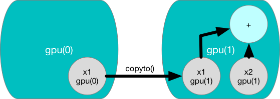

# Manipulate data the MXNet way with `ndarray`

It's impossible to get anything done if we can't manipulate data.
Generally, there are two important things we need to do with:
(i) acquire it! and (ii) process it once it's inside the computer.
There's no point in trying to acquire data if we don't even know how to store it,
so let's get our hands dirty first by playing with synthetic data.

We'll start by introducing NDArrays, MXNet's primary tool for storing and transforming data. If you've worked with NumPy before, you'll notice that NDArrays are, by design, similar to NumPy's multi-dimensional array. However, they confer a few key advantages. First, NDArrays support asynchronous computation on CPU, GPU, and distributed cloud architectures. Second, they provide support for automatic differentiation. These properties make NDArray an ideal library for machine learning, both for researchers and engineers launching production systems.


## Getting started

In this chapter, we'll get you going with the basic functionality. Don't worry if you don't understand any of the basic math, like element-wise operations or normal distributions. In the next two chapters we'll take another pass at NDArray, teaching you both the math you'll need and how to realize it in code.

To get started, let's import `mxnet`. We'll also import `ndarray` from `mxnet` for convenience. We’ll make a habit of setting a random seed so that you always get the same results that we do.

```{.python .input  n=2}
import mxnet as mx
from mxnet import nd
mx.random.seed(1)
```

Next, let's see how to create an NDArray, without any values initialized. Specifically, we'll create a 2D array (also called a *matrix*) with 3 rows and 4 columns.

```{.python .input  n=3}
x = nd.empty((3, 4))
print(x)
```

The `empty` method just grabs some memory and hands us back a matrix without setting the values of any of its entries. This means that the entries can have any form of values, including very big ones! But typically, we'll want our matrices initialized. Commonly, we want a matrix of all zeros.

```{.python .input  n=4}
x = nd.zeros((3, 5))
x
```

Similarly, `ndarray` has a function to create a matrix of all ones.

```{.python .input  n=5}
x = nd.ones((3, 4))
x
```

Often, we'll want to create arrays whose values are sampled randomly. This is especially common when we intend to use the array as a parameter in a neural network. In this snippet, we initialize with values drawn from a standard normal distribution with zero mean and unit variance.

```{.python .input  n=6}
y = nd.random_normal(0, 1, shape=(3, 4))
y
```

As in NumPy, the dimensions of each NDArray are accessible via the `.shape` attribute.

```{.python .input  n=7}
y.shape
```

We can also query its size, which is equal to the product of the components of the shape. Together with the precision of the stored values, this tells us how much memory the array occupies.

```{.python .input  n=8}
y.size
```

## Operations

NDArray supports a large number of standard mathematical operations. Such as element-wise addition:

```{.python .input  n=9}
x + y
```

Multiplication:

```{.python .input  n=10}
x * y
```

And exponentiation:

```{.python .input  n=11}
nd.exp(y)
```

We can also grab a matrix's transpose to compute a proper matrix-matrix product.

```{.python .input  n=12}
nd.dot(x, y.T)
```

We'll explain these operations and present even more operators in the [linear algebra](P01-C03-linear-algebra.ipynb) chapter. But for now, we'll stick with the mechanics of working with NDArrays.

## In-place operations

In the previous example, every time we ran an operation, we allocated new memory to host its results. For example, if we write `y = x + y`, we will dereference the matrix that `y` used to point to and instead point it at the newly allocated memory. We can show this using Python's `id()` function, which tells us precisely which object a variable refers to.

```{.python .input  n=13}
print('id(y):', id(y))
y = y + x
print('id(y):', id(y))
```

We can assign the result to a previously allocated array with slice notation, e.g., `result[:] = ...`.

```{.python .input  n=14}
z = nd.zeros_like(x)
print('id(z):', id(z))
z[:] = x + y
print('id(z):', id(z))
```

However, `x+y` here will still allocate a temporary buffer to store the result before copying it to z. To make better use of memory, we can perform operations in place, avoiding temporary buffers. To do this we specify the `out` keyword argument every operator supports:

```{.python .input  n=15}
nd.elemwise_add(x, y, out=z)
```

If we're not planning to re-use ``x``, then we can assign the result to ``x`` itself. There are two ways to do this in MXNet.
1. By using slice notation x[:] = x op y
2. By using the op-equals operators like `+=`

```{.python .input  n=16}
print('id(x):', id(x))
x += y
x
print('id(x):', id(x))
```

## Slicing
MXNet NDArrays support slicing in all the ridiculous ways you might imagine accessing your data. Here's an example of reading the second and third rows from `x`.

```{.python .input  n=17}
x[1:3]
```

Now let's try writing to a specific element.

```{.python .input  n=18}
x[1,2] = 9.0
x
```

Multi-dimensional slicing is also supported.

```{.python .input  n=19}
x[1:2,1:3]
```

```{.python .input  n=20}
x[1:2,1:3] = 5.0
x
```

## Broadcasting

You might wonder, what happens if you add a vector `y` to a matrix `X`? These operations, where we compose a low dimensional array `y` with a high-dimensional array `X` invoke a functionality called broadcasting. Here, the low-dimensional array is duplicated along any axis with dimension $1$ to match the shape of the high dimensional array. Consider the following example.

```{.python .input  n=21}
x = nd.ones(shape=(3,3))
print('x = ', x)
y = nd.arange(3)
print('y = ', y)
print('x + y = ', x + y)
```

While `y` is initially of shape (3),
MXNet infers its shape to be (1,3),
and then broadcasts along the rows to form a (3,3) matrix).
You might wonder, why did MXNet choose to interpret `y` as a (1,3) matrix and not (3,1).
That's because broadcasting prefers to duplicate along the left most axis.
We can alter this behavior by explicitly giving `y` a 2D shape.

```{.python .input  n=22}
y = y.reshape((3,1))
print('y = ', y)
print('x + y = ', x+y)
```

## Converting from MXNet NDArray to NumPy
Converting MXNet NDArrays to and from NumPy is easy. The converted arrays do not share memory.

```{.python .input  n=23}
a = x.asnumpy()
type(a)
```

```{.python .input  n=24}
y = nd.array(a)
y
```

## Managing context
You might have noticed that MXNet NDArray looks almost identical to NumPy.
But there are a few crucial differences.
One of the key features that differentiates MXNet from NumPy is its support for diverse hardware devices.

In MXNet, every array has a context.
One context could be the CPU.
Other contexts might be various GPUs.
Things can get even hairier when we deploy jobs across multiple servers.
By assigning arrays to contexts intelligently,
we can minimize the time spent transferring data between devices.
For example, when training neural networks on a server with a GPU,
we typically prefer for the model's parameters to live on the GPU.
To start, let's try initializing an array on the first GPU.

```{.python .input  n=25}
from mxnet import gpu
z = nd.ones(shape=(3,3), ctx=gpu(0))
z
```

Given an NDArray on a given context, we can copy it to another context by using the copyto() method.

```{.python .input  n=26}
x_gpu = x.copyto(gpu(0))
print(x_gpu)
```

The result of an operator will have the same context as the inputs.

```{.python .input  n=29}
x_gpu + z
```

If we ever want to check the context of an NDArray programmaticaly,
we can just call its `.context` attribute.

```{.python .input  n=30}
print(x_gpu.context)
print(z.context)
```

In order to perform an operation on two ndarrays `x1` and `x2`,
we need them both to live on the same context.
And if they don't already,
we may need to explicitly copy data from one context to another.
You might think that's annoying.
After all, we just demonstrated that MXNet knows where each NDArray lives.
So why can't MXNet just automatically copy `x1` to `x2.context` and then add them?

In short, people use MXNet to do machine learning
because they expect it to be fast.
But transferring variables between different contexts is slow.
So we want you to be 100% certian that you want to do something slow
before we let you do it.
If MXNet just did the copy automatically without crashing
then you might not realize that you had written some slow code.
We don't want you to spend your entire life on StackOverflow,
so we make some mistakes impossible.



## Watch out!

Imagine that your variable z already lives on your second GPU (`gpu(0)`). What happens if we call `z.copyto(gpu(0))`? It will make a copy and allocate new memory, even though that variable already lives on the desired device!

There are times where depending on the environment our code is running in,
two variables may already live on the same device.
So we only want to make a copy if the variables currently lives on different contexts.
In these cases, we can call `as_in_context()`.
If the variable is already the specified context then this is a no-op.

```{.python .input  n=32}
print('id(z):', id(z))
z = z.copyto(gpu(0))
print('id(z):', id(z))
z = z.as_in_context(gpu(0))
print('id(z):', id(z))
print(z)
```

## Next
[Linear algebra](../chapter01_crashcourse/linear-algebra.md)

For whinges or inquiries, [open an issue on  GitHub.](https://github.com/zackchase/mxnet-the-straight-dope)
