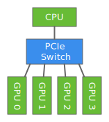

# Training with multiple GPUs from scratch

This tutorial shows how we can increase performance by distributing training across multiple GPUs.
So, as you might expect, running this tutorial requires at least 2 GPUs. 
And these days multi-GPU machines are actually quite common. 
The following figure depicts 4 GPUs on a single machine and connected to the CPU through a PCIe switch. 



If an NVIDIA driver is installed on our machine,
then we can check how many GPUs are available by running the command `nvidia-smi`.

```{.python .input  n=1}
!nvidia-smi
```

We want to use all of the GPUs on together for the purpose of significantly speeding up training (in terms of wall clock). 
Remember that CPUs and GPUs each can have multiple cores. 
CPUs on a laptop might have 2 or 4 cores, and on a server might have up to 16 or 32 cores. 
GPUs tend to have many more cores - an NVIDIA K80 GPU has 4992 - but run at slower clock speeds. 
Exploiting the parallelism across the GPU cores is how GPUs get their speed advantage in the first place. 

As compared to the single CPU or single GPU setting where all the cores are typically used by default,
parallelism across devices is a little more complicated.
That's because most layers of a neural network can only run on a single device. 
So, in order to parallelize across devices, we need to do a little extra.
Therefore, we need to do some additional work to partition a workload across multiple GPUs. 
This can be done in a few ways.

## Data Parallelism

For deep learning, data parallelism is by far the most widely used approach for partitioning workloads. 
It works like this: Assume that we have *k* GPUs. We split the examples in a data batch into *k* parts,
and send each part to a different GPUs which then computes the gradient that part of the batch. 
Finally, we collect the gradients from each of the GPUs and sum them together before updating the weights.

The following pseudo-code shows how to train one data batch on *k* GPUs.

```{.python .input}
# def train_batch(data, k):
#     split data into k parts
#     for i = 1, ..., k:  # run in parallel
#         compute grad_i w.r.t. weight_i using data_i on the i-th GPU
#     grad = grad_1 + ... + grad_k
#     for i = 1, ..., k:  # run in parallel
#         copy grad to i-th GPU
#         update weight_i by using grad
```

Next we will present how to implement this algorithm from scratch.


## Automatic Parallelization

We first demonstrate how to run workloads in parallel. 
Writing parallel code in Python in non-trivial, but fortunately, 
MXNet is able to automatically parallelize the workloads. 
Two technologies help to achieve this goal.

First, workloads, such as `nd.dot` are pushed into the backend engine for *lazy evaluation*. 
That is, Python merely pushes the workload `nd.dot` and returns immediately 
without waiting for the computation to be finished. 
We keep pushing until the results need to be copied out from MXNet, 
such as `print(x)` or are converted into numpy by `x.asnumpy()`. 
At that time, the Python thread is blocked until the results are ready.

```{.python .input  n=2}
from mxnet import nd
from time import time

start = time()
x = nd.random_uniform(shape=(2000,2000))
y = nd.dot(x, x)
print('=== workloads are pushed into the backend engine ===\n%f sec' % (time() - start))
z = y.asnumpy()
print('=== workloads are finished ===\n%f sec' % (time() - start))
```

Second, MXNet depends on a powerful scheduling algorithm that analyzes the dependencies of the pushed workloads.
This scheduler checks to see if two workloads are independent of each other.
If they are, then the engine may run them in parallel.
If a workload depend on results that have not yet been computed, it will be made to wait until its inputs are ready.

For example, if we call three operators:

```{.python .input}
a = nd.random_uniform(shape=(1,2))
b = nd.random_uniform(shape=(1,2))
c = a + b
```

Then the computation for `a` and `b` may run in parallel, 
while `c` cannot be computed until both `a` and `b` are ready. 

The following code shows that the engine effectively parallelizes the `dot` operations on two GPUs:

```{.python .input  n=3}
from mxnet import gpu

def run(x):
    """push 10 matrix-matrix multiplications"""
    return [nd.dot(x,x) for i in range(10)]

def wait(x):
    """explicitly wait until all results are ready"""
    for y in x:
        y.wait_to_read()

x0 = nd.random_uniform(shape=(4000, 4000), ctx=gpu(0))
x1 = x0.copyto(gpu(1))

print('=== Run on GPU 0 and 1 in sequential ===')
start = time()
wait(run(x0))
wait(run(x1))
print('time: %f sec' %(time() - start))

print('=== Run on GPU 0 and 1 in parallel ===')
start = time()
y0 = run(x0)
y1 = run(x1)
wait(y0)
wait(y1)
print('time: %f sec' %(time() - start))
```

```{.python .input  n=4}
from mxnet import cpu

def copy(x, ctx):
    """copy data to a device"""
    return [y.copyto(ctx) for y in x]

print('=== Run on GPU 0 and then copy results to CPU in sequential ===')
start = time()
y0 = run(x0)
wait(y0)
z0 = copy(y0, cpu())
wait(z0)
print(time() - start)

print('=== Run and copy in parallel ===')
start = time()
y0 = run(x0)
z0 = copy(y0, cpu())
wait(z0)
print(time() - start)
```

## Define model and updater

We will use the convolutional neural networks and plain SGD introduced in [cnn-scratch]() as an example workload.

```{.python .input  n=5}
from mxnet import gluon
# initialize parameters
scale = .01
W1 = nd.random_normal(shape=(20,1,3,3))*scale
b1 = nd.zeros(shape=20)
W2 = nd.random_normal(shape=(50,20,5,5))*scale
b2 = nd.zeros(shape=50)
W3 = nd.random_normal(shape=(800,128))*scale
b3 = nd.zeros(shape=128)
W4 = nd.random_normal(shape=(128,10))*scale
b4 = nd.zeros(shape=10)
params = [W1, b1, W2, b2, W3, b3, W4, b4]

# network and loss
def lenet(X, params):
    # first conv
    h1_conv = nd.Convolution(data=X, weight=params[0], bias=params[1], kernel=(3,3), num_filter=20)
    h1_activation = nd.relu(h1_conv)
    h1 = nd.Pooling(data=h1_activation, pool_type="avg", kernel=(2,2), stride=(2,2))
    # second conv
    h2_conv = nd.Convolution(data=h1, weight=params[2], bias=params[3], kernel=(5,5), num_filter=50)
    h2_activation = nd.relu(h2_conv)
    h2 = nd.Pooling(data=h2_activation, pool_type="avg", kernel=(2,2), stride=(2,2))
    h2 = nd.flatten(h2)
    # first fullc
    h3_linear = nd.dot(h2, params[4]) + params[5]
    h3 = nd.relu(h3_linear)
    # second fullc    
    yhat = nd.dot(h3, params[6]) + params[7]    
    return yhat

loss = gluon.loss.SoftmaxCrossEntropyLoss()

# plain SGD
def SGD(params, lr):
    for p in params:
        p[:] = p - lr * p.grad
```

## Utility functions to synchronize data across GPUs

The following function copies the parameters into a particular GPU and initializes the gradients.

```{.python .input  n=6}
def get_params(params, ctx):
    new_params = [p.copyto(ctx) for p in params]
    for p in new_params:
        p.attach_grad()
    return new_params

new_params = get_params(params, gpu(0))
print('=== copy b1 to GPU(0) ===\nweight = {}\ngrad = {}'.format(
    new_params[1], new_params[1].grad))
```

Given a list of data that spans multiple GPUs, we then define a function to sum the data 
and broadcast the results to each GPU.

```{.python .input  n=7}
def allreduce(data):
    # sum on data[0].context, and then broadcast
    for i in range(1, len(data)):
        data[0][:] += data[i].copyto(data[0].context)
    for i in range(1, len(data)):
        data[0].copyto(data[i])        

data = [nd.ones((1,2), ctx=gpu(i))*(i+1) for i in range(2)]
print("=== before allreduce ===\n {}".format(data))
allreduce(data)
print("\n=== after allreduce ===\n {}".format(data))
```

Given a data batch, we define a function that splits this batch and copies each part into the corresponding GPU.

```{.python .input  n=8}
def split_and_load(data, ctx):
    n, k = data.shape[0], len(ctx)
    assert (n//k)*k == n, '# examples is not divided by # devices'
    idx = list(range(0, n+1, n//k))
    return [data[idx[i]:idx[i+1]].as_in_context(ctx[i]) for i in range(k)]

batch = nd.arange(16).reshape((4,4))
print('=== original data ==={}'.format(batch))
ctx = [gpu(0), gpu(1)]
splitted = split_and_load(batch, ctx)
print('\n=== splitted into {} ==={}\n{}'.format(ctx, splitted[0], splitted[1]))
```

## Train and inference one data batch

Now we are ready to implement how to train one data batch with data parallelism.

```{.python .input  n=9}
from mxnet import autograd

def train_batch(batch, params, ctx, lr):
    # split the data batch and load them on GPUs
    data = split_and_load(batch.data[0], ctx)
    label = split_and_load(batch.label[0], ctx)
    # run forward on each GPU
    with autograd.record():
        losses = [loss(lenet(X, W), Y) 
                  for X, Y, W in zip(data, label, params)]
    # run backward on each gpu
    for l in losses:
        l.backward()
    # aggregate gradient over GPUs
    for i in range(len(params[0])):                
        allreduce([params[c][i].grad for c in range(len(ctx))])
    # update parameters with SGD on each GPU
    for p in params:
        SGD(p, lr/batch.data[0].shape[0])
```

For inference, we simply let it run on the first GPU. We leave a data parallelism implementation as an exercise.

```{.python .input  n=10}
def valid_batch(batch, params, ctx):
    data = batch.data[0].as_in_context(ctx[0])
    pred = nd.argmax(lenet(data, params[0]), axis=1)
    return nd.sum(pred == batch.label[0].as_in_context(ctx[0])).asscalar()
```

## Put all things together

Define the program that trains and validates the model on MNIST.

```{.python .input  n=11}
from mxnet.test_utils import get_mnist
from mxnet.io import NDArrayIter

def run(num_gpus, batch_size, lr):    
    # the list of GPUs will be used
    ctx = [gpu(i) for i in range(num_gpus)]
    print('Running on {}'.format(ctx))
    
    # data iterator
    mnist = get_mnist()
    train_data = NDArrayIter(mnist["train_data"], mnist["train_label"], batch_size)
    valid_data = NDArrayIter(mnist["test_data"], mnist["test_label"], batch_size)
    print('Batch size is {}'.format(batch_size))
    
    # copy parameters to all GPUs
    dev_params = [get_params(params, c) for c in ctx]
    for epoch in range(5):
        # train
        start = time()
        train_data.reset()
        for batch in train_data:
            train_batch(batch, dev_params, ctx, lr)
        nd.waitall()  # wait all computations are finished to benchmark the time
        print('Epoch %d, training time = %.1f sec'%(epoch, time()-start))
        
        # validating
        valid_data.reset()
        correct, num = 0.0, 0.0
        for batch in valid_data:
            correct += valid_batch(batch, dev_params, ctx)
            num += batch.data[0].shape[0]                
        print('         validation accuracy = %.4f'%(correct/num))

```

First run on a single GPU with batch size 64.

```{.python .input  n=12}
run(1, 64, 0.3)
```

Running on multiple GPUs, we often want to increase the batch size so that each GPU still gets a large enough batch size for good computation performance. A larger batch size sometimes slows down the convergence, we often want to increases the learning rate as well.

```{.python .input  n=13}
run(2, 128, 0.6)
```

## Conclusion

We have shown how to implement data parallelism on a deep neural network from scratch. Thanks to the auto-parallelism, we only need to write serial codes while the engine is able to parallelize them on multiple GPUs.

## Next
[Training with multiple GPUs with ``gluon``](../chapter07_distributed-learning/multiple-gpus-gluon.ipynb)

For whinges or inquiries, [open an issue on  GitHub.](https://github.com/zackchase/mxnet-the-straight-dope)
