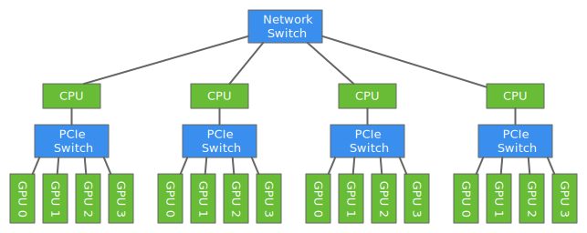
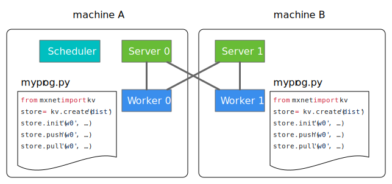

# Distributed training with multiple machines

In the previous two tutorials, we saw
that using multiple GPUs within a machine
can accelerate training.
The speedup, however, is limited
by the number of GPUs installed in that machine.
And it's rare to find a single machine with more than 16 GPUs nowadays.
For some truly large-scale applications,
this speedup might still be insufficient.
For example, it could still take many days
to train a state-of-the-art CNN on millions of images.

In this tutorial, we'll discuss the key concepts you'll need
in order to go from a program that does single-machine training
to one that executes distributed training across multiple machines.
We depict a typical distributed system in the following figure, where
multiple machines are connected by network switches.



Note that the way we used `copyto` to copy data from one GPU to another in the [multiple-GPU tutorial](../multiple-gpus-scratch.ipynb) does not work when our GPUs are sitting on different machines. To make use of the available resources here well need a better abstraction.

## Key-value store

MXNet provides a key-value store to synchronize data among devices. The following code initializes an `ndarray` associated with the key "weight" on a key-value store.

```{.python .input  n=1}
from mxnet import kv, nd
store = kv.create('local')
shape = (2, 3)
x = nd.random_uniform(shape=shape)
store.init('weight', x)
print('=== init "weight" ==={}'.format(x))
```

```{.json .output n=1}
[
 {
  "name": "stdout",
  "output_type": "stream",
  "text": "=== init \"weight\" ===\n[[ 0.79415995  0.88229781  0.15982462]\n [ 0.93108964  0.39078727  0.85333389]]\n<NDArray 2x3 @cpu(0)>\n"
 }
]
```

After initialization, we can pull the value to multiple devices.

```{.python .input  n=2}
from mxnet import gpu
ctx = [gpu(0), gpu(1)]
y = [nd.zeros(shape, ctx=c) for c in ctx]
store.pull('weight', out=y)
print('=== pull "weight" to {} ===\n{}'.format(ctx, y))
```

```{.json .output n=2}
[
 {
  "name": "stdout",
  "output_type": "stream",
  "text": "=== pull \"weight\" to [gpu(0), gpu(1)] ===\n[\n[[ 0.79415995  0.88229781  0.15982462]\n [ 0.93108964  0.39078727  0.85333389]]\n<NDArray 2x3 @gpu(0)>, \n[[ 0.79415995  0.88229781  0.15982462]\n [ 0.93108964  0.39078727  0.85333389]]\n<NDArray 2x3 @gpu(1)>]\n"
 }
]
```

We can also push new data value into the store. It will first sum the data on the same key and then overwrite the current value.

```{.python .input  n=3}
z = [nd.ones(shape, ctx=ctx[i])+i for i in range(len(ctx))]
store.push('weight', z)
print('=== push to "weight" ===\n{}'.format(z))
store.pull('weight', out=y)
print('=== pull "weight" ===\n{}'.format(y))
```

```{.json .output n=3}
[
 {
  "name": "stdout",
  "output_type": "stream",
  "text": "=== push to \"weight\" ===\n[\n[[ 1.  1.  1.]\n [ 1.  1.  1.]]\n<NDArray 2x3 @gpu(0)>, \n[[ 2.  2.  2.]\n [ 2.  2.  2.]]\n<NDArray 2x3 @gpu(1)>]\n=== pull \"weight\" ===\n[\n[[ 3.  3.  3.]\n [ 3.  3.  3.]]\n<NDArray 2x3 @gpu(0)>, \n[[ 3.  3.  3.]\n [ 3.  3.  3.]]\n<NDArray 2x3 @gpu(1)>]\n"
 }
]
```

With `push` and `pull` we can replace the `allreduce` function defined in [multiple-gpus-scratch](P14-C02-multiple-gpus-scratch.ipynb) by

```{.python .input  n=4}
def allreduce(data, data_name, store):
    store.push(data_name, data)
    store.pull(data_name, out=data)
```

## Distributed key-value store

Not only can we synchronize data within a machine, with the key-value store we can facilitate inter-machine communication. To use it, one can create a distributed kvstore by using the following command: (Note: distributed key-value store requires `MXNet` to be compiled with the flag `USE_DIST_KVSTORE=1`, e.g. `make USE_DIST_KVSTORE=1`.)

```{.python .input  n=5}
# store = kv.create('dist')
```

Now if we run the code from the previous section on two machines at the same time, then the store will aggregate the two ndarrays pushed from each machine, and after that, the pulled results will be:

```{.python .input  n=6}
# [[ 6.  6.  6.]
#  [ 6.  6.  6.]]
```

In the distributed setting, `MXNet` launches three kinds of processes (each time, running `python myprog.py` will create a process). One is a *worker*, which runs the user program, such as the code in the previous section. The other two are the *server*, which maintains the data pushed into the store, and the *scheduler*, which monitors the aliveness of each node.

It's up to users which machines to run these processes on. But to simplify the process placement and launching, MXNet provides a tool located at [tools/launch.py](https://github.com/dmlc/mxnet/blob/master/tools/launch.py).

Assume there are two machines, A and B. They are ssh-able, and their IPs are saved in a file named `hostfile`. Then we can start one worker in each machine through:

```{.python .input  n=7}
# $ mxnet_path/tools/launch.py -H hostfile -n 2 python myprog.py
```

It will also start a server in each machine, and the scheduler on the same machine we are currently on.



## Using `kvstore` in `gluon`

As mentioned in [our section on training with multiple GPUs from scratch](multiple-gpus-scratch.ipynb#data-parallelism), to implement data parallelism we just need to specify

- how to split data
- how to synchronize gradients and weights

We already see from [multiple-gpu-gluon](P14-C03-multiple-gpus-gluon.ipynb#put-all-things-together) that a `gluon` trainer can automatically aggregate the gradients among different GPUs. What it really does is having a key-value store with type `local` within it. Therefore, to change to multi-machine training we only need to pass a distributed key-value store, for example,

```{.python .input  n=8}
# store = kv.create('dist')
# trainer = gluon.Trainer(..., kvstore=store)
```

To split the data, however, we cannot directly copy the previous approach. One commonly used solution is to split the whole dataset into *k* parts at the beginning, then let the *i*-th worker only read the *i*-th part of the data.

We can obtain the total number of workers by reading the attribute `num_workers` and the rank of the current worker from the attribute `rank`.

```{.python .input  n=9}
# print('total number of workers: %d'%(store.num_workers))
# print('my rank among workers: %d'%(store.rank))
```

With this information, we can manually access the proper chunk of the input data. In addition, several data iterators provided by `MXNet` already support reading only part of the data. For example,

```{.python .input  n=10}
# from mxnet.io import ImageRecordIter
# data = ImageRecordIter(num_parts=store.num_workers, part_index=store.rank, ...)
```

For whinges or inquiries, [open an issue on  GitHub.](https://github.com/zackchase/mxnet-the-straight-dope)
